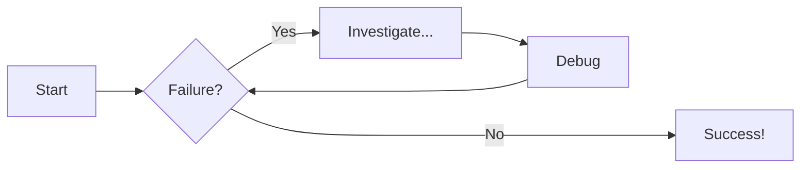
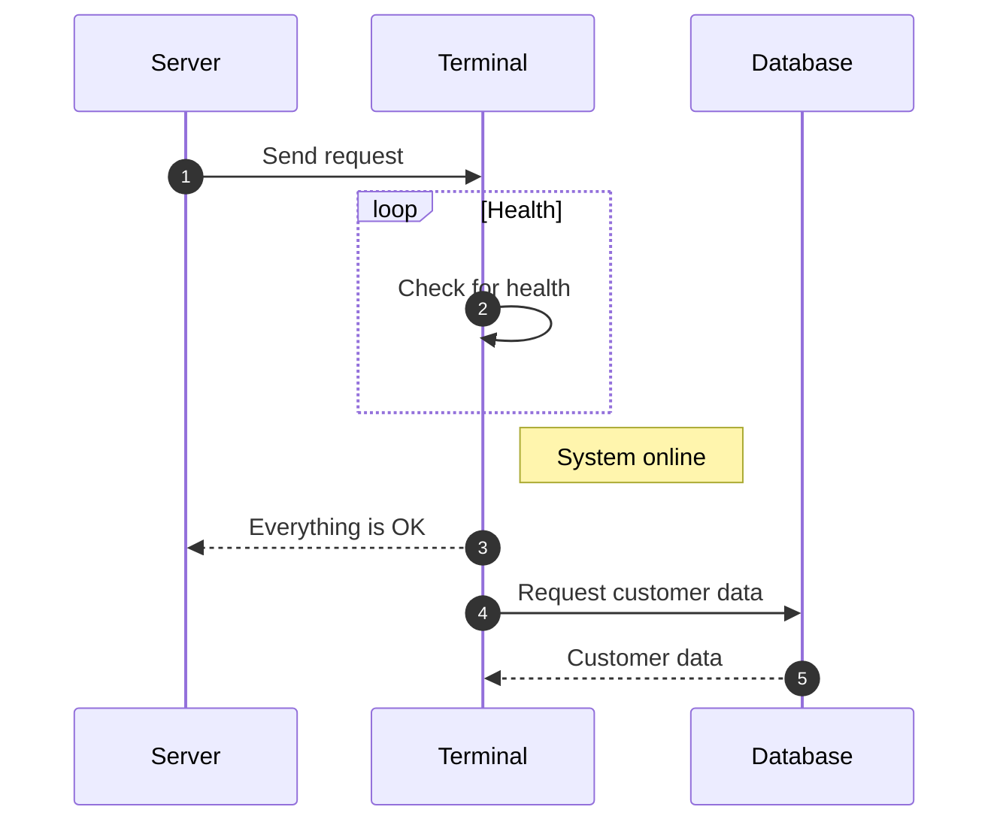

# Source Code Examples
This page is for maintainers of this website.

Check out the source code to learn how each piece is made

For full documentation visit [mkdocs.org](https://www.mkdocs.org).

## Code Snippets

```java title="Example Java code" linenums="1" hl_lines="3-4"
// This is an example of Jave code with line numbers and lines 3-4 highlighted
int teamNum = 422
if (teamNum==422) {
    System.out.println("This is team 422");
}
else {
    System.out.println("This is not team 422");
}
```

## Content Tabs
=== "Plain Text"
    Use the bars above to navigate
=== "Unordered List"
    * First
    * Second
    * Third
=== "Ordered List"
    1. First
    2. Second
    3. Third

## Code With Content Tabs
=== "Java"
    ```java
    int teamNum = 422
    System.out.println(teamNum + " wins worlds!");
    ```
=== "Python"
    ```py
    teamNum=422
    print(teamNum +" wins worlds!")
    ```
## Admonitions (ie Callouts)
### Regular
!!! note "Important Note"
    The class name MUST match the name of the file for your code to run.
### Collapsible
???+ info "Collapsible Note"
    If you are missing the run code button, make sure your file is saved!
### Different Icon
??? question "Want more icons?"
    Visit [this link](https://squidfunk.github.io/mkdocs-material/reference/admonitions/?h=adm#supported-types) to find the list of supported icons.

## Diagrams
### Flowcharts



### Sequence Diagrams

