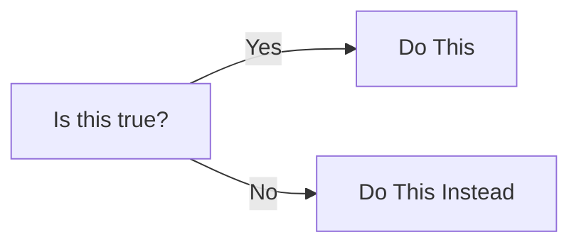

# Lesson 2: Comparision Operators, Conditionals And For Loops

## Operators

### Comparision operators

Operators in Java are typically grouped into categories depending on their function. One of these is the comparision operators, which are used to compare two values. This is especially important for conditionals and for loops, as it defines when they run or how long to run for. Below is a list of operators which are used commonly.

- `==`: Equal to (5 == 5 → true)

- `!=`: Not equal to (5 != 3 → true)

- `>`: Greater than (7 > 4 → true)

- `<`: Less than (2 < 6 → true)

- `>=`: Greater than or equal to (7 >= 7 → true)

- `<=`: Less than or equal to (3 <= 5 → true)

Comparision operators will output a boolean value, either true or false, depending on the values provided. You can use the output for setting members, using conditionals, and more. Below is an example of using comparision operators.


```java
boolean isGreater = 5>7;
// isGreater is false
if (5==5) {
    System.out.println("This is true");
}
```

### Arithmetic operators

Arithmetic operators are used for basic mathematical operations, such as adding or subtracting two values. Here is a list of common arithmetic operators:


- `+`: Addition
- `-`: Subtraction
- `*`: Multiplication
- `/`: Division
- `%`: Modulus (remainder after division)

Using arithmetic operators is simple. Just place them between the two values you want to use it on.

```java
int a = 5;
int b = 6;
System.out.println(a+b);
System.out.println(a%b);
```

``` title="Output"
11
1
```


## Conditionals

A conditional is a way to make choices based on the current situation. The program asks itself _is this true?_, and if so do this, otherwise, do something else. The diagram below shows a visual representation of a conditional.



Java has three types of conditional statements, `if`, `else if`, and `else`.

### If statements

An `if` statement is the first part of any conditional. It initiates the check by asking if something is equal to some value. The syntax for an `if` statement is shown below.

```java
if (condition) {
    // do this
}
if (vehicle.color == "red") {
    System.out.println("The car is red");
}
```

The condition can be anything that you want Java to evaluate. It could be some basic math operations, such as `5>6`, which would evaluate to false. It could also use variables (members) from last lesson, such as `if(boolean)`, which will always evaluate to either true or false, since those are the only two values a `boolean` can store. The above example checks if the color of the vehicle is red, and __if so__, print out "The car is red".

### Else statements

An `else` statement is the next conditional in the flow of a conditional chain. This serves as the alternative action if the first `if` statement evaluates to false.

```java
if (condition) {
    // do this
}

else {
    // do this
}

if (vehicle.color == "red") {
    System.out.println("The car is red");
}

else {
    System.out.println("The car is not red");
}

```

In the example above, the first if statement checks whether the car is red. If the car is not red, that condition evaluates to false, and the program moves to the `else` block. The `else` block doesn’t have its own condition, it simply runs whenever the if statement fails, acting like a “catch-all” for everything that wasn’t true.

### Else if statements

What if you wanted to check if the car was blue? Although you could technically put multiple `if` statements one-after-another, Java has an efficient way to check different conditions, called an `else if` block. Check out the example below to see the difference.

=== "Bad example"
    ```java
    if (vehicle.color == "red") {
        System.out.println("The car is red");
    }

    if (vehicle.color == "blue") {
        System.out.println("The car is blue");
    }

    if (vehicle.color == "orange") {
        System.out.println("The car is orange");
    }

    else {
        System.out.println("The car is not red");
    }
    ```
=== "Good example"
    ```java
    if (vehicle.color == "red") {
        System.out.println("The car is red");
    }

    else if (vehicle.color == "blue") {
        System.out.println("The car is blue");
    }

    else if (vehicle.color == "orange") {
        System.out.println("The car is orange");
    }

    else {
        System.out.println("The car is not red");
    }
    ```

Notice how only the middle two `if` statements were changed to `else if`.
This small change makes the code much more efficient:

- With `else if`, Java stops checking as soon as one condition is true. For example, if the car is blue, Java checks red, then checks blue, and then exits the chain immediately.

- With separate `if` statements, Java would still check all the other conditions, even if one was already true. That means if the car is blue, it would still check orange, which is unnecessary.

By using `else if`, you make your code both faster and easier to read.

### Conditionals with booleans

Conditionals can also be used with booleans directly, since they can only be either true or false. The snippet below provides an example.

```java
boolean carIsOn = true;

if (carIsOn) {
    System.out.println("Ready to drive");
}
else {
    System.out.println("Turn car on to drive");
}
```

``` title="Output"
Ready to drive
```
You wouldn't need to say `if (carIsOn==true)`, since Java knows that since its a boolean value, it can only be true or false, so it handles the checking for you.


!!! note "Usage of `else` and `else if`"
    You won't always need an `else if` or even an `else` condition. This depends on your code and if you want to do something if the first `if` condition is false.

## For Loops

A `for` loop is a way to repeat a block of code a set number of times. Think of it like this: imagine you’re told to do 10 push-ups. Instead of someone saying “Do a push-up, do a push-up, do a push-up…” ten times, they just say “Do 10 push-ups.” A `for` loop works the same way — it repeats your instructions automatically until the count is done.

### Syntax

The proper way to write a for loop uses a variable, typically called `i`, to keep track of how many times the loop has run. An example is shown below.

```java
for (int i=0;i<10;i++) {
    // Do a push-up
}
```

You can break down the inside, `int i=0;i<10;i++`, into three main parts: Initialization, condition, and update/increment.

#### Initialization

Just like when you create a member, Java needs a variable inside the loop to keep track of how many times it has run. This follows the same pattern you’ve already seen: `type name = value`. In the example above, the type is `int`, the name is `i`, and the starting value is `0`. That means the counter variable `i` begins at 0, and Java will use it to control how many times the loop repeats. You may also begin the counter `i` above `0`, which is typically used when counting down.

#### Condition

This part of the `for` loop statement — the condition — controls how many times your code will repeat. The condition is checked before each iteration, and the loop only continues if it evaluates to `true`. The condition is usually written in the form: `name<value`. Here, name is the variable from the initialization, and value sets the stopping point.
!!! note "Use of <"
    At first glance, a condition like `i < 10` might seem like the loop will only run 9 times. However, since the counter `i` starts at `0`, the loop runs for `i = 0, 1, 2, ..., 9`, which is 10 iterations total. This “zero-based counting” is standard practice in Java (and most programming languages).

Examples of conditions you can use:

- Less than (i < 10) → loop runs while i is less than 10.

- Less than or equal to (i <= 10) → loop runs while i is less than or equal to 10 (so it runs 11 times if starting from 0).

- Greater than (i > 0) → often used when counting down.

- Greater than or equal to (i >= 0) → loop continues until i drops below 0.

- Equality check (i == 5) → less common, but possible if you only want to run when i hits a specific value.

#### Update

The update (also called the increment) is the last portion of a `for` loop. It controls how the loop variable changes after each iteration. In most cases, such as the example, this is written as `i++`, which means “increase `i` by 1.”

The update is essential — without it, the condition might never be met, causing an infinite loop.

Examples of updates:

- `i++`: increases by 1 (most common).

- `i--`: decreases by 1 (useful for counting down).

- `i += 2`: increases by 2 (counts even numbers if starting at 0).

- `i *= 2`: doubles the value each time.

The update doesn’t always have to be an increment; it can be any expression that changes the loop variable. This flexibility allows for loops to handle many patterns, like skipping numbers, looping backward, or growing exponentially.

### Combining initialization, condition, and update

The example below shows how you can use the three components of a `for` loop to count down from 10, skipping every other number.

```java
for (int i=10; i>=0; i -=2) {
    System.out.print(i + " ");
}
```
``` title="Output"
10 8 6 4 2 0 
```

Here, the `i` variable starts at 10 and we decrease it by 2 every time the loop runs. This continues while `i` is greater than or equal to 0.

---

## Practice

Look at the code below. What will it print?

=== "Identify"
    ```java
    for (int i = 0; i <= 5; i++) {
        if (i % 2 == 0) {
            System.out.println(i + " is even");
        } else if (i > 3) {
            System.out.println(i + " is greater than 3 and odd");
        } else {
            System.out.println(i + " is odd");
        }
    }
    ```
=== "Answers"
    ``` title="Output"
    0 is even
    1 is odd
    2 is even
    3 is odd
    4 is even
    5 is greater than 3 and odd
    ```