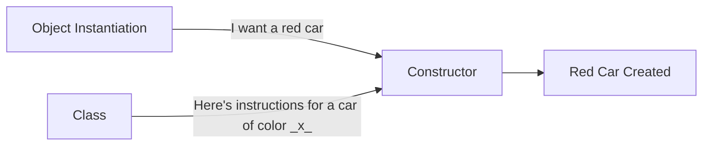

# Lesson 3: Classes, Objects, And Constructors

## Classes
A class in Java is like a blueprint for something you are trying to make. Imagine a blueprint for the car from the last lesson. You cannot physically drive the blueprint, but you can follow it to make the actual car. Similarly, classes themselves cannot do anything, but the class can be used to create an object that __can__ do things.

All methods and members reside in a class. Most Java projects start with a `Main` class, titled `Main.java`. This is where your _main_ code lives. For FRC, `Main.java` is taken care of by WPILib, so we won't ever have to touch it.

!!! warning "Important"
    Your class name __MUST__ match the name and capitalization of the file for it to run. It is something that is specific to Java and will cause an error if not followed.

```java title="Car.java"
public class Car {
   // Your methods and members will go here
}
```

Writing classes in Java is pretty simple. All it requires is the name of the class. The above example creates a class named `Car` in the `Car.java` file.

## Objects

An object is a real, usable thing created from a class, which is like its blueprint or recipe. The class describes what the object can have and can do, but by itself, it’s not something you can use yet.

When you create an object, it gets its own data (called members or fields), which stores information about that specific object. It also gets methods, which are the actions it can perform.

For example, for the Car class: it might say that every car has a color, speed, and fuelLevel, and that it can drive(), brake(), or honk(). When you make a car object, you now have a real car in your program: it might be red, going 50 mph, and able to honk whenever you call myCar.honk().

### How to create an object

Creating an object, or making it exist, is called instantiation. Instantiation refers to the fact that you are creating a _unique_ instance of a class. Although many cars may use the same blueprint to build them, they may vary in tiny details, such as their color, top speed, or model. Each specific car is called an instance. The snippet below shows how to instantiate an object.

```java
class name = new class();
Car Acura = new Car("red", 50);
```
To instantiate and object, you must first specify its class. Just like how you must tell Java what type of member you are creating, you must tell it what type of object you are creating. 

Then, you provide a name for the object. Much like methods and members, the name of an object is anything that describes what the object is. 

Next, you must use the `new` operator to create a new car. 

Finally, you must specify the class once again so that Java knows what blueprint to use to build the object.

Additionally, if your class contains members, you can define it inside the parenthesis. This takes advantage of the object being a unique instance, meaning you can have multiple Acuras of a variety of colors. In this example, the car is red and starts at 50 mph.

### Using an object

Java is an object-oriented program language, which means that objects will take the members and methods of a class. This allows objects created by `instantiation` to perform actions of its assigned class. This is done using the __dot operator__, which is simply a `.` placed after the object name, which allows you to access the methods and members of the instance.


=== "Main.java"
    ```java title="Main.java" linenums="1"
    public class Main {
        Car Acura = new Car("red");

        Acura.drive();

        System.out.println(Acura.color);

        Car Toyota = new Car("orange");

        Toyota.drive();

        System.out.println(Toyota.color);
    }
    ```
=== "Car.java"
    ```java title="Car.java" 
    public class Car {
        private String color;

        public void drive() {
            // insert drive code
        }

        public void stop() {
            // insert stop code
        }
    }
    ```
``` title="Output"
red
orange
```
In the above example, we have instantiated two unique cars, an Acura and a Toyota. Since both the Acura and the Toyota are made from the `Car` class, they can both drive and stop. However, since they are objects unique of each other, they each have their own color, which is also accessed using the dot operator.

## Constructors

A constructor is a special method in Java that connects your object instantiation to the class blueprint. Think of it like this: The object instiation is a person looking to get a house built, the class is the blueprint for the house, and the constructor is the one who builds the house using the blueprint and adding in the buyer's preferences.

In the above example, the constructor would be in charge of making a red car that starts at 50 mph using a blueprint for a generic car.


### Writing a constructor
Constructors exist in the class. Highlighted below is an example constructor for the `Car` class.

```java title="Car.java" hl_lines="4-6"
public class Car {
    private String color;

    public Car(String color) {
        this.color = color;
    }
}
```
This constructor assigns the color specified during instantiation to the specific _instance_ of the car.

## Combining Classes, Objects, and Constructors

=== "Main.java"
    ```java title="Main.java"
    public class Main {
        Car Acura = new Car("red");
    }
    ```
=== "Car.java"
    ```java title="Car.java" 
    public class Car {
        private String color;

        public Car(String color) {
            this.color = color;
        }

        public void drive() {
            // insert drive code
        }

        public void stop() {
            // insert stop code
        }
    }
    ```

Here's what happens when you run the code above:

1. A new object of type `Car` named `Acura` is attempting to be instantiated. It wants to be a red car. This happens in the `Main.java` file.
2. The `Car` constructor is called with the argument `"red"`. This happens in the `Car.java` file.
3. The constructor assigns the value `"red"` to the `color` field of the `Acura` object.
4. The `Acura` object is now fully instantiated and represents a red car. This car can use the methods outlined in the `Car.java` class, such as drive() and stop().

---

## Practice 
See if you can correctly identify the class, object, and constructor in the following code snippet.
=== "Identify"
    ```java
    public class Car {
    private String color;

        public Car(String color) {
            this.color = color;
        }

        public void honk() {
            System.out.println("Beep!");
        }
    }

    Car acura = new Car("red");
    ``` 
=== "Answers"
    ```java
    public class Car { ... } // Class
    public Car(String color) { ... } // Constructor
    Car acura = new Car("red"); // Object instantiation
    ``` 
